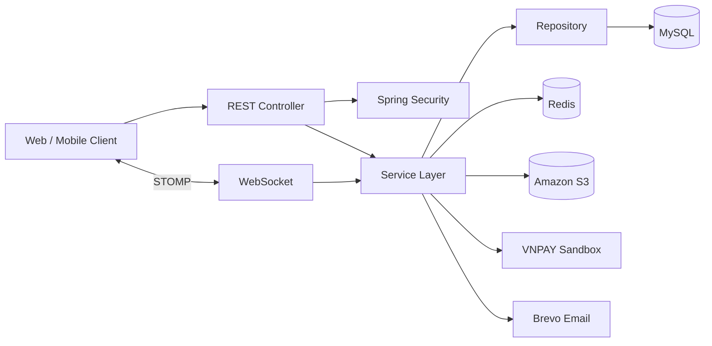

# LearningHub Backend

Backend REST API cho nền tảng học trực tuyến LearningHub. Hệ thống quản lý người dùng, khóa học, quá trình học, điểm, thanh toán, doanh thu giảng viên, rút tiền, đánh giá, chat realtime, thông báo và chứng chỉ.

## Mục tiêu dự án

- Tổ chức REST API theo layered architecture: controller → service → repository.
- Xử lý authentication/authorization với nhiều role và permission.
- Bảo đảm tính nhất quán khi cập nhật điểm, mua khóa học, thanh toán và rút tiền đồng thời.
- Tích hợp MySQL, Redis, Amazon S3, VNPAY, Google OAuth2, WebSocket/STOMP và Brevo.
- Dùng DTO/mapper thay vì trả trực tiếp JPA Entity.

## Công nghệ

- Java 21, Spring Boot, Maven
- Spring Web MVC, Validation, AOP, WebSocket/STOMP
- Spring Security, JWT, OAuth2 Resource Server và Google OAuth2
- Spring Data JPA, Hibernate, MySQL 8+
- Flyway database migration
- Redis, Spring Cache, rate limiting và token blacklist
- MapStruct, Lombok
- AWS SDK for Java v2 (S3)
- VNPAY Sandbox, Brevo Transactional Email
- Thymeleaf, OpenHTMLtoPDF, Springdoc OpenAPI/Swagger

## Tính năng

### Authentication và authorization

- Đăng nhập bằng JWT access token/refresh token và Google.
- Đăng ký, xác minh email, gửi lại mã, quên và đặt lại mật khẩu.
- Role chính: `USER`, `TEACHER`, `ADMIN`.
- Method-level authorization bằng Spring Security.
- Token blacklist, giới hạn đăng nhập sai và rate limiting qua Redis.

### Course và learning

- CRUD course, chapter, lesson; upload thumbnail, video và tài liệu.
- Quy trình `DRAFT → PENDING → APPROVED/REJECTED/BANNED/DELETED`.
- Tìm kiếm, lọc, sắp xếp và phân trang bằng JPA Specification.
- Mua khóa học bằng point, enrollment, yêu thích, đánh giá và phản hồi.
- Theo dõi tiến độ lesson/course và danh sách khóa học của người dùng.
- Preview khóa học, thông tin giảng viên và khóa học theo giảng viên.

### Point, payment và withdrawal

- Ví point và lịch sử point transaction.
- Nạp point qua VNPAY Sandbox; tỷ lệ mặc định `1.000 VND = 1 point`.
- Return URL/IPN callback, kiểm tra chữ ký và xử lý callback theo hướng idempotent.
- Admin điều chỉnh/cộng/trừ/thưởng point.
- Quản lý doanh thu, tài khoản ngân hàng và yêu cầu rút tiền của giảng viên.
- Job tự cập nhật payment hết hạn và vô hiệu hóa advertisement hết hạn.

### S3 và certificate

- Upload avatar, thumbnail, advertisement, hồ sơ, chứng từ và payment proof.
- Presigned upload URL cho video, tài liệu và hình ảnh chat lớn.
- Presigned download URL cho object private.
- Database lưu S3 object key, không lưu full URL cố định.
- Dọn S3 orphan object theo lịch.
- Xóa nội dung chapter/lesson của course đã soft-delete theo job riêng.
- Sinh certificate PDF từ template HTML, lưu trên S3 và xác minh bằng verification code.

### Realtime và notification

- Chat hỗ trợ, hỏi đáp khóa học và liên hệ học viên bằng WebSocket/STOMP.
- Tin nhắn văn bản và hình ảnh; ảnh upload trực tiếp lên S3 qua presigned URL.
- Thông báo realtime, unread count, đánh dấu đã đọc và xóa thông báo.
- Job dọn thông báo cũ.

### Redis cache

- Cache course detail, danh sách course và gợi ý tiêu đề.
- TTL riêng cho từng loại cache.
- Evict cache khi course thay đổi hoặc đổi trạng thái.
- Chỉ cache response DTO, không cache managed JPA Entity.

## Kiến trúc



```text
controller → service interface → service implementation → repository
                         ↘ DTO ↔ mapper
```

- Controller nhận request và trả `ApiResponse`.
- Service chứa business logic và transaction boundary.
- Repository làm việc với persistence layer.
- Mapper chuyển đổi Entity/DTO.
- Exception handler dùng chung chuyển lỗi thành response chuẩn và `ErrorCode`.

## Các điểm kỹ thuật quan trọng

### Transaction và concurrent request

Business logic cập nhật nhiều dữ liệu liên quan được bọc bằng transaction. Một số luồng nhạy cảm như point balance, mua course, payment và withdrawal dùng pessimistic locking để hạn chế lost update, double-spend và xử lý trùng khi có concurrent request.

### Payment idempotency

Payment được lưu trước khi chuyển sang VNPAY. Backend xác minh callback/IPN, kiểm tra trạng thái hiện tại và chỉ cộng point một lần dù callback được gửi lại nhiều lần.

### Quản lý object trên S3

File nhỏ có thể đi qua backend; video, tài liệu và ảnh chat dùng presigned URL để client upload trực tiếp. Database chỉ giữ object key; URL tải private được tạo khi client yêu cầu và có thời hạn.

### Redis strategy

Redis dùng cho cache, rate limit và blacklist token. Cache liên quan course được evict sau khi course cập nhật hoặc đổi trạng thái.

## Cấu hình môi trường

Ứng dụng dùng ba file YAML:

| File | Mục đích |
|---|---|
| `src/main/resources/application.yaml` | Cấu hình dùng chung, đọc biến môi trường; server context path là `/api/v1` |
| `src/main/resources/application-dev.yml` | Local/dev: `ddl-auto: validate`, bật SQL log và Swagger |
| `src/main/resources/application-prod.yml` | Production: `ddl-auto: validate`, tắt SQL log và Swagger |
| `src/main/resources/db/migration` | Flyway migrations; schema được nâng cấp trước khi Hibernate validate |

Chọn profile bằng `SPRING_PROFILES_ACTIVE`:

```env
SPRING_PROFILES_ACTIVE=dev   # local
SPRING_PROFILES_ACTIVE=prod  # production
```

### Biến môi trường backend

Đặt các giá trị này trong environment, secret manager hoặc file `.env` của backend. Không commit credential thật.

```env
# Server và ứng dụng
SERVER_PORT=8080
FRONTEND_URL=http://localhost:5173
OPENAPI_SERVICE_SERVER=http://localhost:8080/api/v1

# Tài khoản admin khởi tạo
APP_ADMIN_USERNAME=admin
APP_ADMIN_PASSWORD=change-me
APP_ADMIN_FULL_NAME=LearningHub Admin
APP_ADMIN_EMAIL=admin@example.com
APP_ADMIN_PHONE_NUMBER=0000000000

# Profile và database
SPRING_PROFILES_ACTIVE=dev
SPRING_DATASOURCE_URL=jdbc:mysql://localhost:3306/learninghub
SPRING_DATASOURCE_USERNAME=root
SPRING_DATASOURCE_PASSWORD=your-password
SPRING_FLYWAY_ENABLED=true
SPRING_FLYWAY_BASELINE_ON_MIGRATE=true

# Redis
REDIS_HOST=localhost
REDIS_PORT=6379
REDIS_PASSWORD=
REDIS_DATABASE=0

# Security và Google
JWT_KEY=your-long-jwt-signing-key
GOOGLE_CLIENT_ID=your-google-client-id

# Email/Brevo
BREVO_API_KEY=your-brevo-api-key
BREVO_FROM_EMAIL=no-reply@example.com

# Amazon S3
S3_ACCESS_KEY=your-access-key
S3_SECRET_KEY=your-secret-key
S3_BUCKET_NAME=your-private-bucket
S3_BASE_PREFIX=learninghub

# VNPAY Sandbox
VNPAY_PAY_URL=https://sandbox.vnpayment.vn/paymentv2/vpcpay.html
VNPAY_RETURN_URL=http://localhost:8080/api/v1/payments/vnpay/return
VNPAY_FRONTEND_RETURN_URL=http://localhost:5173/payment-result
VNPAY_TMN_CODE=your-tmn-code
VNPAY_HASH_SECRET=your-hash-secret
```

### Scheduled jobs

Các job được cấu hình trong `application.yaml` và chạy theo múi giờ `Asia/Ho_Chi_Minh`:

| Job | Lịch mặc định |
|---|---|
| Payment expiration | Chạy lặp mỗi 60 giây |
| Notification cleanup | 03:00 mỗi ngày, giữ 60 ngày |
| Advertisement deactivation | 00:00 mỗi ngày |
| S3 orphan cleanup | 03:00 Chủ nhật, grace period 24 giờ |
| Deleted course content cleanup | Bật theo cấu hình |

## Yêu cầu cài đặt

- JDK 21
- MySQL 8+
- Redis 7+
- Tài khoản/bucket Amazon S3
- VNPAY Sandbox credentials
- Brevo API key

Khởi tạo database:

```sql
CREATE DATABASE learninghub
  CHARACTER SET utf8mb4
  COLLATE utf8mb4_unicode_ci;
```

Khi ứng dụng khởi động, Flyway tự chạy các file trong `src/main/resources/db/migration` rồi Hibernate dùng `ddl-auto: validate` để kiểm tra mapping. Với database đã tồn tại từ trước, hãy backup trước và để `SPRING_FLYWAY_BASELINE_ON_MIGRATE=true` cho lần chạy đầu để tạo mốc Flyway version `1` mà không sửa dữ liệu hiện có; sau khi kiểm tra bảng `flyway_schema_history`, nên chuyển biến này thành `false` ở production. Database mới sẽ chạy migration `V1__initial_schema.sql`.

Chạy Redis nhanh bằng Docker:

```bash
docker run --name learninghub-redis -p 6379:6379 -d redis:7-alpine
```

## Chạy local

Windows PowerShell:

```powershell
$env:SPRING_PROFILES_ACTIVE="dev"
.\mvnw.cmd spring-boot:run
```

Linux/macOS:

```bash
export SPRING_PROFILES_ACTIVE=dev
./mvnw spring-boot:run
```

Địa chỉ mặc định:

```text
API:        http://localhost:8080/api/v1
Swagger UI: http://localhost:8080/api/v1/swagger-ui/index.html
```

Swagger và API docs bị tắt trong profile `prod`.

## Docker và Docker Compose

`Dockerfile` dùng build nhiều tầng với Maven/Corretto 21. `docker-compose.yml` chạy MySQL, Redis và backend trong cùng network. Cần khai báo các biến compose như `MYSQL_DATABASE`, `MYSQL_USER`, `MYSQL_PASSWORD`, `MYSQL_ROOT_PASSWORD`, `REDIS_PASSWORD`, `REDIS_DATABASE`, `DOCKER_USERNAME`, `IMAGE_TAG` và `SERVER_PORT` trong `.env`.

```bash
docker compose up -d
```

Build image backend:

```bash
docker build -t learninghub-backend .
```

## API tiêu biểu

Tất cả endpoint bên dưới đều có prefix `/api/v1`:

| Module | Method | Endpoint | Chức năng |
|---|---|---|---|
| Auth | POST | `/auth/login` | Đăng nhập và nhận token |
| Auth | POST | `/auth/login/google` | Đăng nhập Google |
| User | GET | `/users/me` | Lấy người dùng hiện tại |
| Course | GET | `/courses/list` | Tìm kiếm course đã approved |
| Course | GET | `/courses/{id}` | Chi tiết course |
| Course | GET | `/courses/{id}/preview` | Preview course |
| Course | GET | `/courses/teacher/{teacherId}` | Course theo giảng viên |
| Enrollment | POST | `/enrollments/buy` | Mua course bằng point |
| Progress | POST | `/lesson-progress/{lessonId}/complete` | Hoàn thành lesson |
| Payment | POST | `/payments/vnpay/deposits` | Tạo yêu cầu nạp point |
| Point | GET | `/users/me/points/transactions` | Lịch sử point transaction |
| Certificate | GET | `/certificates/courses/{courseId}/download` | Tải certificate |
| Certificate | GET | `/certificates/verify/{code}` | Xác minh certificate |
| Teacher | POST | `/teachers/register` | Đăng ký giảng viên |
| Withdrawal | POST | `/teacher/withdrawals` | Tạo yêu cầu rút tiền |
| Conversation | GET | `/conversations` | Danh sách cuộc trò chuyện |
| Conversation | GET | `/conversations/{id}/messages` | Lịch sử tin nhắn |
| Conversation | GET | `/conversations/upload-url` | Presigned URL upload ảnh chat |
| Notification | GET | `/notifications` | Danh sách thông báo |
| Admin course | PATCH | `/admin/course/{id}/approve` | Duyệt course |
| Admin teacher | POST | `/admin/teachers/{userId}/approve` | Duyệt hồ sơ giảng viên |
| Admin advertisement | DELETE | `/admin/advertisements/expired` | Xóa quảng cáo hết hạn |

Danh sách request/response đầy đủ được cung cấp tại Swagger trong profile `dev`.

## WebSocket/STOMP

- SockJS endpoint: `/api/v1/ws`
- Gửi tin nhắn: `/app/chat.send`
- Subscribe chat conversation: `/topic/conversation/{conversationId}`
- Subscribe thông báo cá nhân: `/user/queue/notifications`
- Subscribe chat notification: `/user/queue/chat-notifications`

Client phải gửi access token trong STOMP `CONNECT` header:

```text
Authorization: Bearer <access-token>
```

## Redis cache

TTL tham khảo trong cấu hình service:

| Cache | TTL |
|---|---:|
| Course detail | 15 phút |
| Course list | 5 phút |
| Course title suggestion | 10 phút |

Kiểm tra cache:

```bash
redis-cli SCAN 0 MATCH "learninghub::*" COUNT 100
redis-cli TTL "learninghub::courses::1"
```

## Cấu trúc source

```text
src/main/java/com/dxh/learninghub/
├─ configuration/     # Security, Redis, WebSocket, OpenAPI, VNPAY
├─ constant/          # Hằng số và tên cache
├─ controller/        # REST/WebSocket controller; admin/ cho Admin
├─ dto/               # request/response DTO
├─ entity/            # JPA entity và Redis model
├─ enums/             # Enum nghiệp vụ
├─ exception/         # ErrorCode và global handler
├─ job/               # Scheduled jobs
├─ mapper/            # MapStruct mapper
├─ repo/               # JPA/Redis repository và specification
├─ service/            # Interface, implementation và external service
├─ utils/              # Tiện ích dùng chung
└─ validator/          # Custom validator và rate-limit aspect
```

## Testing

```bash
./mvnw test
```

Có thể bổ sung unit test, repository test, security test, concurrency test và integration test bằng Testcontainers khi mở rộng dự án.

## Roadmap

- Bổ sung integration test bằng Testcontainers.
- Bổ sung các migration Flyway tiếp theo cho mọi thay đổi schema.
- CI/CD, dependency scanning, metrics và tracing.
- Centralized logging và event-driven flow cho advertisement/email.
- Mở rộng kiểm thử VNPAY callback và concurrent course purchase.
