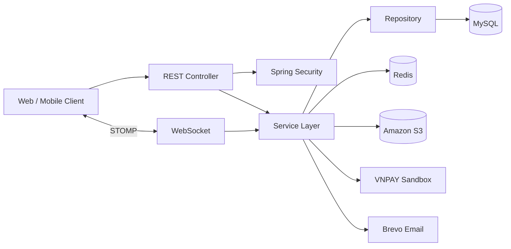

# LearningHub Backend

LearningHub là backend cho nền tảng học trực tuyến, hỗ trợ quản lý khóa học, quá trình học, thanh toán và point, doanh thu giảng viên, chat, notification và certificate.

Dự án được xây dựng với mục tiêu thực hành Java Backend và Spring Boot thông qua các nghiệp vụ có nhiều trạng thái, phân quyền, transaction, concurrent request và tích hợp dịch vụ bên ngoài.

## Mục tiêu dự án

- Thiết kế REST API và tổ chức ứng dụng theo layered architecture
- Xử lý authentication và authorization với nhiều role
- Áp dụng transaction trong các nghiệp vụ cập nhật nhiều dữ liệu liên quan
- Hạn chế race condition khi nhiều request cùng thay đổi số dư hoặc trạng thái
- Tích hợp Redis, Amazon S3, VNPAY, WebSocket và email service
- Sử dụng cache cho những dữ liệu được đọc thường xuyên

## Tính năng đã thực hiện

### Authentication và Authorization

- JWT access token và refresh token
- Google login
- Xác minh email, quên mật khẩu và đặt lại mật khẩu
- Role và permission cho `USER`, `TEACHER`, `ADMIN`
- Token blacklist, giới hạn đăng nhập sai và rate limiting bằng Redis
- Method-level authorization bằng Spring Security

### Course và Learning

- Quản lý course, chapter và lesson
- Quy trình approve, reject, ban, soft-delete và restore course
- Search course bằng JPA Specification
- Pagination và sorting với danh sách field cho phép
- Favorite, review, rating và phản hồi review
- Enrollment và mua khóa học bằng point
- Theo dõi lesson progress và course progress

### Payment, Point và Withdrawal

- Tích hợp VNPAY Sandbox để nạp point với tỷ lệ `1.000 VND = 1 point`
- Xử lý Return URL, IPN callback và cập nhật trạng thái payment
- Lưu lịch sử point transaction và hỗ trợ Admin điều chỉnh point
- Quản lý doanh thu, bank account và withdrawal request của giảng viên
- Scheduled job cập nhật các payment hết hạn

### Amazon S3 và Certificate

- Backend upload cho avatar, thumbnail, advertisement, CV và payment proof
- Presigned upload URL cho video và tài liệu lớn
- Presigned download URL cho private object
- Database lưu S3 object key thay vì full URL
- Scheduled job dọn orphan object
- Sinh certificate PDF từ HTML template và lưu trên S3
- Kiểm tra certificate bằng verification code

### Realtime và Notification

- Chat riêng bằng WebSocket/STOMP
- Realtime notification
- Unread message và unread notification count
- Scheduled job dọn notification cũ

### Redis Cache

- Cache course detail, course list và title suggestion
- TTL riêng cho từng cache
- Cache eviction khi course được cập nhật hoặc thay đổi trạng thái
- Chỉ cache response DTO, không cache managed JPA Entity

## Một số điểm kỹ thuật

### Transaction và concurrent request

Business logic được xử lý tại service layer và sử dụng transaction khi cập nhật nhiều dữ liệu liên quan. Pessimistic locking được áp dụng cho một số luồng như point balance, course purchase, payment và withdrawal nhằm hạn chế lost update hoặc xử lý trùng khi có concurrent request.

### Xử lý payment

Payment được lưu trước khi người dùng chuyển sang VNPAY. Backend tiếp nhận và xác minh callback trước khi cập nhật payment và cộng point. Luồng xử lý được thiết kế theo hướng idempotent để hạn chế cộng point lặp lại khi callback được gửi nhiều lần.

### Quản lý file trên Amazon S3

File nhỏ được upload qua backend, trong khi video và tài liệu lớn sử dụng presigned URL để client upload trực tiếp lên S3. Hệ thống lưu object key trong database và tạo presigned URL khi client cần truy cập private object.

### Redis strategy

Redis được sử dụng cho cache, token blacklist và rate limiting. Mỗi Course cache có TTL riêng và các cache liên quan được evict sau khi dữ liệu Course thay đổi.

## Kiến trúc hệ thống



```text
controller -> service interface -> service implementation -> repository
                     |                     |
                    DTO                 mapper
```

- Controller tiếp nhận request và trả response
- Service xử lý business logic và transaction
- Repository làm việc với persistence layer
- MapStruct chuyển đổi giữa Entity và DTO
- API không trả trực tiếp JPA Entity

## Công nghệ sử dụng

- Java 21
- Spring Boot 3.3
- Spring Web MVC, WebSocket và STOMP
- Spring Security, JWT và OAuth2 Resource Server
- Spring Data JPA, Hibernate và MySQL
- Redis và Spring Cache
- MapStruct và Lombok
- Amazon S3 SDK v2
- VNPAY Sandbox
- Brevo Transactional Email
- Thymeleaf và OpenHTMLtoPDF
- Swagger/OpenAPI
- Maven

## Cấu trúc source code

```text
src/main
├── java/com/dxh/learninghub
│   ├── configuration       # Security, Redis, WebSocket, OpenAPI, VNPAY
│   ├── constant            # Hằng số dùng chung và tên cache
│   ├── controller          # REST và WebSocket endpoint
│   │   └── admin           # API dành cho Admin
│   ├── dto
│   │   ├── request         # Request DTO
│   │   └── response        # Response DTO
│   │       └── admin       # Response dành cho Admin
│   ├── entity              # JPA Entity và Redis Hash
│   ├── enums               # Enum nghiệp vụ
│   ├── exception           # ErrorCode và global exception handler
│   ├── job                 # Scheduled job
│   ├── mapper              # MapStruct mapper
│   ├── repo                # JPA và Redis repository
│   │   └── specification   # Course search specification
│   ├── service             # External service và service dùng chung
│   │   ├── interfac        # Service interface
│   │   │   └── admin       # Service interface dành cho Admin
│   │   └── impl            # Service implementation
│   │       └── admin       # Business logic dành cho Admin
│   ├── utils               # Tiện ích dùng chung
│   └── validator           # Custom validation, rate limiting aspect
└── resources
    ├── application.yaml
    ├── banner.txt
    └── templates
        └── certificate-template.html
```

## Hướng dẫn cài đặt

### Yêu cầu

- JDK 21
- MySQL 8+
- Redis 7+
- AWS S3 credentials
- VNPAY Sandbox credentials
- Brevo API key

### Khởi tạo database

```sql
CREATE DATABASE learninghub
    CHARACTER SET utf8mb4
    COLLATE utf8mb4_unicode_ci;
```

### Chạy Redis bằng Docker

```bash
docker run --name learninghub-redis -p 6379:6379 -d redis:7-alpine
```

### Environment variables

```bash
JWT_KEY=your-jwt-signing-key

SPRING_DATASOURCE_URL=jdbc:mysql://localhost:3306/learninghub
SPRING_DATASOURCE_USERNAME=root
SPRING_DATASOURCE_PASSWORD=your-password

REDIS_HOST=localhost
REDIS_PORT=6379
REDIS_PASSWORD=
REDIS_DATABASE=0

S3_ACCESS_KEY=your-access-key
S3_SECRET_KEY=your-secret-key
AWS_S3_BUCKET_NAME=your-private-bucket
S3_BASE_PREFIX=learninghub

VNPAY_TMN_CODE=your-sandbox-terminal-code
VNPAY_HASH_SECRET=your-sandbox-hash-secret
VNPAY_RETURN_URL=https://your-domain/api/v1/payments/vnpay/return
VNPAY_FRONTEND_RETURN_URL=http://localhost:3000/payment-result

SPRING_BREVO_API_KEY=your-brevo-api-key
SPRING_BREVO_FROM_EMAIL=no-reply@example.com
SPRING_BREVO_FROM_NAME=LearningHub
```

Không commit credential thật lên Git. Khi public repository nên sử dụng environment variable hoặc secret manager.

### Chạy ứng dụng

Windows:

```powershell
.\mvnw.cmd spring-boot:run
```

Linux/macOS:

```bash
./mvnw spring-boot:run
```

```text
API:        http://localhost:8080/api/v1
Swagger UI: http://localhost:8080/api/v1/swagger-ui/index.html
```

## Một số API tiêu biểu

| Module | Method | Endpoint | Chức năng |
|---|---|---|---|
| Auth | POST | `/auth/login` | Đăng nhập và nhận token |
| Course | GET | `/courses/list` | Tìm kiếm course đã approve |
| Course | GET | `/courses/{courseId}` | Lấy thông tin course |
| Enrollment | POST | `/enrollments/buy` | Mua course bằng point |
| Progress | POST | `/lesson-progress/{lessonId}/complete` | Hoàn thành lesson |
| Payment | POST | `/payments/vnpay/deposits` | Tạo yêu cầu nạp point |
| Point | GET | `/users/me/points/transactions` | Xem lịch sử point |
| Certificate | GET | `/certificates/courses/{courseId}/download` | Sinh hoặc tải certificate |
| Certificate | GET | `/certificates/verify/{code}` | Kiểm tra certificate |
| Teacher | POST | `/teachers/register` | Đăng ký trở thành giảng viên |
| Withdrawal | POST | `/teacher/withdrawals` | Tạo withdrawal request |
| Admin | PATCH | `/admin/course/{id}/approve` | Approve course |

Danh sách endpoint và request/response model đầy đủ được cung cấp tại Swagger UI.

## Redis Cache

| Cache | TTL |
|---|---:|
| `courses` | 15 phút |
| `course-list` | 5 phút |
| `course-title` | 10 phút |

```bash
redis-cli SCAN 0 MATCH "learninghub::*" COUNT 100
redis-cli TTL "learninghub::courses::1"
```

## Testing

Hiện tại dự án có application context test để kiểm tra khả năng khởi tạo Spring context. Unit test, repository test, security test, concurrency test và integration test sẽ được bổ sung trong các phiên bản tiếp theo.

```bash
./mvnw test
```

## Roadmap

- Sử dụng Kafka cho advertisement hoặc email event
- Bổ sung integration test bằng Testcontainers
- Viết test cho VNPAY callback và concurrent course purchase
- Quản lý database migration bằng Flyway
- Thêm Docker Compose
- Xây dựng CI/CD pipeline và dependency scanning
- Bổ sung metrics, tracing và centralized logging
- Deploy ứng dụng và bổ sung thông tin môi trường chạy thực tế
